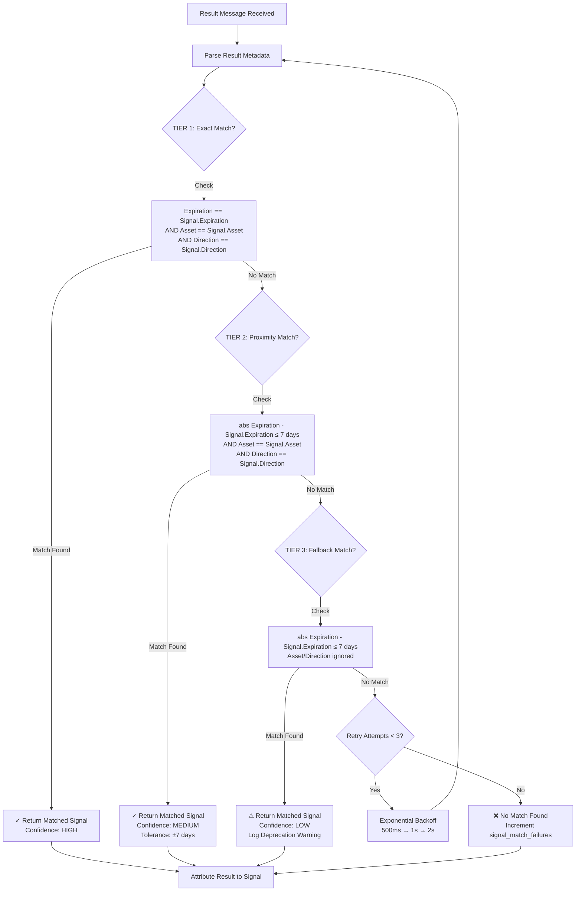

# Listener Architecture

## System Overview

The SnapTrade listener is a resilient Telegram message monitoring service with automatic crash recovery, exponential backoff reconnection, and real-time alerting capabilities.

## Crash Recovery Flow

```
┌─────────────────────────────────────────────────────────────────┐
│                         Main Loop                                │
│                  (while should_retry())                          │
└─────────────────┬───────────────────────────────────────────────┘
                  │
                  ▼
         ┌────────────────┐
         │  Try: Connect  │
         │  & Run Client  │
         └────────┬───────┘
                  │
                  │ Exception?
                  ▼
    ┌─────────────────────────┐
    │   Except Handler        │
    │   - ConnectionError     │
    │   - TimeoutError        │
    │   - OSError             │
    │   - Exception (generic) │
    └─────────┬───────────────┘
              │
              ▼
    ┌──────────────────────────┐
    │ ReconnectionManager      │
    │  .record_failure()       │
    │   - Increment attempt    │
    │   - Set reconnecting     │
    │   - Record timestamp     │
    └─────────┬────────────────┘
              │
              ▼
    ┌──────────────────────────┐
    │  TelegramAlerter         │
    │   .send_alert()          │
    │   - Format severity      │
    │   - Send via Bot API     │
    │   - Rate limit alerts    │
    └─────────┬────────────────┘
              │
              ▼
    ┌──────────────────────────┐
    │  Check should_retry()    │
    │   max_retries exceeded?  │
    └─────────┬────────────────┘
              │
              ├─ NO → Send CRITICAL alert
              │       Exit with sys.exit(1)
              │
              └─ YES ▼
              ┌──────────────────────────┐
              │  Exponential Backoff     │
              │  calculate_next_delay()  │
              │   delay = initial_delay  │
              │     × (multiplier ^ N)   │
              │   capped at max_delay    │
              └─────────┬────────────────┘
                        │
                        ▼
              ┌──────────────────────────┐
              │   asyncio.sleep(delay)   │
              └─────────┬────────────────┘
                        │
                        ▼
              ┌──────────────────────────┐
              │   Reconnect Attempt      │
              │   Loop back to Try block │
              └─────────┬────────────────┘
                        │
                        ▼
              ┌──────────────────────────┐
              │  Success? reset()        │
              │   - Clear attempt count  │
              │   - Send recovery alert  │
              │   - Update metrics       │
              └──────────────────────────┘
```

## Core Components

### ReconnectionManager

**Purpose**: Manages connection retry logic with exponential backoff strategy.

**Location**: `listener.py` (line 138)

**Attributes**:
- `config: ReconnectionConfig` - Backoff parameters (initial_delay, max_delay, backoff_multiplier, max_retries)
- `attempt_count: int` - Current number of consecutive failures
- `current_delay: float` - Current delay value in seconds
- `state: ConnectionState` - Current connection state (DISCONNECTED, CONNECTING, CONNECTED, RECONNECTING, FAILED)
- `last_failure_time: Optional[datetime]` - Timestamp of most recent failure

**Key Methods**:

1. **`calculate_next_delay() -> float`**
   - Implements exponential backoff: `initial_delay × (backoff_multiplier ^ attempt_count)`
   - Caps delay at `max_delay` to prevent excessive wait times
   - Returns delay in seconds

2. **`should_retry() -> bool`**
   - Checks if another reconnection attempt should be made
   - Returns `True` if `max_retries` is `None` (unlimited) or attempts < max_retries
   - Returns `False` when retry limit is exceeded

3. **`record_failure() -> None`**
   - Increments `attempt_count`
   - Records `last_failure_time` with UTC timestamp
   - Recalculates `current_delay` for next retry

4. **`reset() -> None`**
   - Called after successful connection
   - Resets `attempt_count` to 0
   - Resets `current_delay` to `initial_delay`
   - Clears `last_failure_time`

**Default Configuration** (from environment):
- Initial delay: 1 second (`INITIAL_RECONNECT_DELAY_SECONDS`)
- Max delay: 60 seconds (`MAX_RECONNECT_DELAY_SECONDS`)
- Backoff multiplier: 2x
- Max retries: Unlimited (None)

**Example Backoff Sequence**:
```
Attempt 1: 1s
Attempt 2: 2s
Attempt 3: 4s
Attempt 4: 8s
Attempt 5: 16s
Attempt 6: 32s
Attempt 7+: 60s (capped)
```

---

### TelegramAlerter

**Purpose**: Sends formatted alerts to Telegram via Bot API with rate limiting.

**Location**: `listener.py` (line 317)

**Attributes**:
- `bot_token: str` - Telegram Bot API token
- `chat_id: str` - Target chat ID for alerts
- `last_alert_time: dict` - Tracks last send time per alert key for rate limiting

**Key Methods**:

1. **`async send_alert(message: str, severity: str) -> None`**
   - Sends alert with severity-based emoji prefix
   - Implements 60-second rate limiting per unique alert
   - Uses async HTTP POST to `https://api.telegram.org/bot{token}/sendMessage`
   - 5-second timeout for alert delivery
   - Silently fails if bot_token or chat_id are missing

**Severity Levels**:
| Severity  | Emoji | Use Case                              |
|-----------|-------|---------------------------------------|
| info      | ℹ️    | Normal operations, recovery messages  |
| warning   | ⚠️    | Connection loss, retry attempts       |
| error     | 🚨    | Unexpected errors, connection issues  |
| critical  | 💥    | Max retries exceeded, manual required |

**Rate Limiting**:
- Alert key: `"{severity}:{message}"`
- Suppression window: 60 seconds
- Prevents alert flooding during rapid failures

**Example Alert Flow**:
```python
# Connection lost - WARNING alert
await alerter.send_alert(
    f'🔌 Connection Lost\n\nAttempt: {attempt_count}\nNext retry in: {delay}s',
    'WARNING'
)

# Max retries - CRITICAL alert
await alerter.send_alert(
    '🛑 Listener Failed\n\nMax retries exceeded. Manual intervention required.',
    'CRITICAL'
)

# Recovery - INFO alert
await alerter.send_alert(
    f'✅ Listener Recovered\n\nReconnected after {attempt_count} attempts\nDowntime: {downtime}s',
    'INFO'
)
```

---

## Signal Result Matching

**Purpose**: Matches incoming result messages to active signals using a 3-tier matching algorithm that solves the D3 race condition.

**Location**: `listener.py` - `find_matching_signal()` method (line 687)

### Problem: D3 Race Condition

The **D3 race condition** occurs when result messages arrive before their corresponding signal messages due to asynchronous Telegram message processing. This creates a timing issue where:
- Result message is processed first
- No matching signal exists in `active_signals` yet
- Result cannot be attributed to any position
- Leads to orphaned results and incorrect P&L tracking

**Solution**: The 3-tier matching algorithm searches backward in time through recent signals to find the best match even when signals arrive out of order.

### Signal Flow Diagram

```
┌──────────────────────────────────────────────────────────────────┐
│                    Telegram Message Stream                        │
└────────────────────────┬─────────────────────────────────────────┘
                         │
                         ├─► Signal Message
                         │   │
                         │   ▼
                         │  ┌─────────────────────────┐
                         │  │  Parse signal metadata  │
                         │  │  - asset (e.g., SPY)    │
                         │  │  - expiration date      │
                         │  │  - direction (call/put) │
                         │  └──────────┬──────────────┘
                         │             │
                         │             ▼
                         │  ┌─────────────────────────┐
                         │  │   Store in              │
                         │  │   active_signals dict   │
                         │  │   key: signal_id        │
                         │  └─────────────────────────┘
                         │
                         └─► Result Message
                             │
                             ▼
                            ┌─────────────────────────────┐
                            │  find_matching_signal()     │
                            │  3-Tier Search Algorithm    │
                            └──────────┬──────────────────┘
                                       │
                   ┌───────────────────┼───────────────────┐
                   │                   │                   │
                   ▼                   ▼                   ▼
            ┌──────────┐        ┌──────────┐       ┌──────────┐
            │  Tier 1  │        │  Tier 2  │       │  Tier 3  │
            │  Exact   │   →    │ Proximity│  →    │ Fallback │
            │  Match   │        │  + Asset │       │  Only    │
            └────┬─────┘        └────┬─────┘       └────┬─────┘
                 │                   │                   │
                 └───────────────────┼───────────────────┘
                                     │
                                     ▼
                            ┌─────────────────┐
                            │ Attribute result│
                            │ to matched      │
                            │ signal/position │
                            └─────────────────┘
```

### 3-Tier Matching Algorithm

The matching algorithm uses a cascading priority system with three tiers, searching in order until a match is found:



#### TIER 1: Exact Match (Highest Priority)

**Matching Criteria**:
- ✓ Expiration date **exactly matches** signal expiration
- ✓ Asset symbol **exactly matches** (after normalization)
- ✓ Direction (call/put) **exactly matches**

**Tolerance Windows**: None - requires exact match on all three parameters

**When Used**: Signal has complete metadata and position exists with exact parameters

**Confidence Level**: **HIGHEST** - eliminates all ambiguity

**Example**:
- Result: SPY call expiring 2026-04-17
- Signal: SPY call expiring 2026-04-17
- ✓ **MATCH** - All parameters identical

---

#### TIER 2: Proximity Match (Medium Priority)

**Matching Criteria**:
- ✓ Expiration date **within ±7 days** of signal expiration
- ✓ Asset symbol **exactly matches** (after normalization)
- ✓ Direction (call/put) **exactly matches**

**Tolerance Windows**: **±7 calendar days** on expiration date only

**When Used**: Minor date discrepancies but asset/direction integrity maintained

**Confidence Level**: **MEDIUM** - handles date variations while ensuring correctness

**Use Cases**:
- Weekly options with slight date differences
- T+1 settlement timing variations
- Signal data with minor date parsing differences
- Timezone-related date shifts

**Example**:
- Result: SPY call expiring 2026-04-17
- Signal: SPY call expiring 2026-04-15 (2 days earlier)
- ✓ **MATCH** - Within 7-day window, asset + direction match

**Fallback Behavior**: If multiple signals match in Tier 2, selects the most recent signal by timestamp

---

#### TIER 3: Fallback Match (Lowest Priority)

**Matching Criteria**:
- ✓ Expiration date **within ±7 days** of signal expiration
- ⚠ Asset symbol **NOT validated**
- ⚠ Direction **NOT validated**

**Tolerance Windows**: **±7 calendar days** on expiration date only

**When Used**: Legacy signals lacking asset/direction metadata

**Confidence Level**: **LOW** - backward compatibility only

**Warning**: Logs deprecation warning when used; emits metric `signal_match_tier:3`

**Fallback Behavior**:
- Selects most recent signal within time window
- Logs warning with signal details for manual verification
- Intended to be phased out as signal sources are updated

**Goal**: Phase out over time as all signal sources adopt full metadata

**Example**:
- Result: SPY call expiring 2026-04-17
- Signal: AAPL put expiring 2026-04-16 (potentially wrong asset/direction!)
- ⚠ **MATCH** - Only expiration within window, no validation of asset/direction

### Disambiguation Strategy

When multiple signals match at the same tier:
1. **Select most recent signal** (latest timestamp)
2. **Log ambiguity warning** with matched signal details
3. **Emit metric** for monitoring multi-match frequency

### D3 Race Condition Resolution

**Problem**: Result messages may arrive before their corresponding signal messages due to asynchronous Telegram processing, causing attribution failures.

**Solution**: Multi-layer defense strategy combining retries, time-based searching, and tolerance windows.

#### Retry Logic with Exponential Backoff

When no match is found in any tier:

1. **Attempt 1**: Immediate search through all three tiers
2. **Attempt 2**: Wait 500ms, retry all three tiers (allows delayed signal to arrive)
3. **Attempt 3**: Wait 1000ms (1s), retry all three tiers
4. **Attempt 4**: Wait 2000ms (2s), final retry through all three tiers
5. **Final**: If still no match, log failure and increment `signal_match_failures` metric

**Total Grace Period**: Up to 3.5 seconds for out-of-order signals to arrive

**Why This Works**:
- **Tier 1-2 exact/proximity matching** ensures correct attribution when signals arrive in order
- **Tier 3 fallback** handles legacy signals with incomplete metadata
- **Retry delays** accommodate race conditions where results arrive before signals
- **Combined approach** solves both metadata incompleteness AND timing issues

#### Monitoring Metrics

| Metric | Description | Target |
|--------|-------------|--------|
| `signal_match_tier` | Distribution of which tier matched | >90% Tier 1 |
| `signal_match_failures` | Unmatched results count | <1% of results |
| `signal_match_retries` | Race condition frequency | <5% of results |
| `signal_match_ambiguities` | Multiple matches at same tier | <0.1% of results |

**Alert Thresholds**:
- Tier 1 match rate drops below 85% → Investigate signal quality
- Match failures exceed 2% → Check for signal source issues
- Retry rate exceeds 10% → Telegram API latency spike or signal ordering issues

### Helper: calculate_signal_expiration_time()

**Purpose**: Calculates the exact expected expiration timestamp for a signal, accounting for martingale position sequences.

**Location**: `listener.py`

**Logic**:
- Determines which reference time to use for expiration calculation:
  - **Primary**: Uses `last_martingale_time` if available (for martingale sequences)
  - **Fallback**: Uses signal's original timestamp if no martingale history exists
- Adds the configured expiration duration to the reference time
- Returns the calculated expiration as a datetime object

**Edge Cases**:
- **Day boundary handling**: Correctly handles signals created near midnight by using precise timestamp arithmetic
- **Timezone consistency**: Ensures all calculations use UTC to avoid DST/timezone edge cases
- **Martingale sequences**: For positions that have been averaged down, uses the most recent entry time rather than the original signal time to calculate accurate expiration windows

**Use Case**: Determines when a signal should be removed from `active_signals` to prevent stale signal accumulation and ensure accurate matching windows.

### Helper: normalize_asset_for_matching()

**Purpose**: Normalizes asset symbols to a consistent format for reliable asset comparison across different signal sources and message formats.

**Location**: `listener.py` (line 600)

**Normalization Rules**:
1. **Whitespace handling**: Strips leading/trailing whitespace
2. **Case normalization**: Converts to uppercase
3. **OTC variant handling**:
   - Converts `_otc` → `OTC` (removes underscore)
   - Converts `-otc` → `OTC` (removes hyphen)
4. **Space removal**: Removes internal spaces from asset symbols

**Examples**:
```
"eurusd"       → "EURUSD"
" EURUSD "     → "EURUSD"
"EURUSD_otc"   → "EURUSDOTC"
"EURUSD-otc"   → "EURUSDOTC"
"eur usd"      → "EURUSD"
""             → ""
```

**Use Case**: Ensures asset matching works correctly across different signal sources that may use different casing, whitespace, or OTC variant formatting conventions (e.g., "EURUSD_otc" vs "EURUSDOTC"). Used in the 3-tier matching algorithm to guarantee consistent asset comparisons.

---

## Exception Handling Strategy

The main loop handles multiple exception types with specific recovery strategies:

1. **FloodWaitError** (Telegram rate limit)
   - Does NOT increment failure count
   - Sleeps for required duration + 5s buffer
   - Does not trigger reconnection flow

2. **ConnectionError**
   - Records failure via `reconnection_manager.record_failure()`
   - Sends WARNING alert with attempt count and next retry time
   - Triggers exponential backoff

3. **TimeoutError**
   - Records failure and triggers reconnection
   - Sends alert with timeout message

4. **OSError** (network errors)
   - Handles network-level failures
   - Records failure and triggers reconnection

5. **Exception** (catch-all)
   - Generic handler for unexpected errors
   - Records failure and attempts reconnection
   - Ensures system stays resilient

All exception handlers:
- Call `record_exception(e)` for tracking
- Call `health_tracker.record_error()` for metrics
- Call `gc.collect()` to clean up memory
- Check `should_retry()` before continuing

---

## State Transitions

```
DISCONNECTED → CONNECTING → CONNECTED
                    ↓
                (exception)
                    ↓
              RECONNECTING → CONNECTING → CONNECTED
                    ↓                         ↓
              (max retries)                (reset)
                    ↓
                 FAILED
              (sys.exit(1))
```

---

## Metrics & Monitoring

**ConnectionMetrics** tracks:
- `total_reconnections` - Lifetime reconnection count
- `total_downtime_seconds` - Cumulative downtime
- `successful_connections` - Successful reconnection attempts
- `failed_connections` - Failed reconnection attempts

**HealthTracker** tracks:
- `last_heartbeat` - Timestamp of last processed message
- `message_count` - Total messages processed
- `error_count` - Total errors encountered

Metrics are persisted to `metrics.json` and loaded on restart for continuity.

---

## Configuration

Environment variables:
- `MAX_RECONNECT_DELAY_SECONDS` (default: 60)
- `INITIAL_RECONNECT_DELAY_SECONDS` (default: 1)
- `TELEGRAM_ALERT_BOT_TOKEN` - Bot token for alerts
- `TELEGRAM_ALERT_CHAT_ID` - Chat ID for alerts

---

## Design Principles

1. **Resilience**: Automatic recovery from all exception types
2. **Observability**: Real-time alerts for all state changes
3. **Bounded Backoff**: Exponential backoff capped at reasonable maximum
4. **Rate Limiting**: Prevent alert flooding during cascading failures
5. **Graceful Degradation**: Continues without alerts if Bot API is unavailable
6. **Memory Management**: Explicit garbage collection after errors
7. **Persistence**: Metrics survive process restarts
